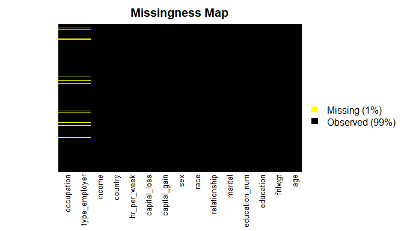

## Setup

### Load packages


```r
library(ggplot2)
library(dplyr)
library(statsr)
```

### Load data


```r
adult <- read.csv('adult_sal.csv')
head(adult)
```

```
##   X age    type_employer fnlwgt education education_num            marital
## 1 1  39        State-gov  77516 Bachelors            13      Never-married
## 2 2  50 Self-emp-not-inc  83311 Bachelors            13 Married-civ-spouse
## 3 3  38          Private 215646   HS-grad             9           Divorced
## 4 4  53          Private 234721      11th             7 Married-civ-spouse
## 5 5  28          Private 338409 Bachelors            13 Married-civ-spouse
## 6 6  37          Private 284582   Masters            14 Married-civ-spouse
##          occupation  relationship  race    sex capital_gain capital_loss
## 1      Adm-clerical Not-in-family White   Male         2174            0
## 2   Exec-managerial       Husband White   Male            0            0
## 3 Handlers-cleaners Not-in-family White   Male            0            0
## 4 Handlers-cleaners       Husband Black   Male            0            0
## 5    Prof-specialty          Wife Black Female            0            0
## 6   Exec-managerial          Wife White Female            0            0
##   hr_per_week       country income
## 1          40 United-States  <=50K
## 2          13 United-States  <=50K
## 3          40 United-States  <=50K
## 4          40 United-States  <=50K
## 5          40          Cuba  <=50K
## 6          40 United-States  <=50K
```

```r
adult <- select(adult,-X)
head(adult)
```

```
##   age    type_employer fnlwgt education education_num            marital
## 1  39        State-gov  77516 Bachelors            13      Never-married
## 2  50 Self-emp-not-inc  83311 Bachelors            13 Married-civ-spouse
## 3  38          Private 215646   HS-grad             9           Divorced
## 4  53          Private 234721      11th             7 Married-civ-spouse
## 5  28          Private 338409 Bachelors            13 Married-civ-spouse
## 6  37          Private 284582   Masters            14 Married-civ-spouse
##          occupation  relationship  race    sex capital_gain capital_loss
## 1      Adm-clerical Not-in-family White   Male         2174            0
## 2   Exec-managerial       Husband White   Male            0            0
## 3 Handlers-cleaners Not-in-family White   Male            0            0
## 4 Handlers-cleaners       Husband Black   Male            0            0
## 5    Prof-specialty          Wife Black Female            0            0
## 6   Exec-managerial          Wife White Female            0            0
##   hr_per_week       country income
## 1          40 United-States  <=50K
## 2          13 United-States  <=50K
## 3          40 United-States  <=50K
## 4          40 United-States  <=50K
## 5          40          Cuba  <=50K
## 6          40 United-States  <=50K
```


```r
str(adult)
```

```
## 'data.frame':	32561 obs. of  15 variables:
##  $ age          : int  39 50 38 53 28 37 49 52 31 42 ...
##  $ type_employer: Factor w/ 9 levels "?","Federal-gov",..: 8 7 5 5 5 5 5 7 5 5 ...
##  $ fnlwgt       : int  77516 83311 215646 234721 338409 284582 160187 209642 45781 159449 ...
##  $ education    : Factor w/ 16 levels "10th","11th",..: 10 10 12 2 10 13 7 12 13 10 ...
##  $ education_num: int  13 13 9 7 13 14 5 9 14 13 ...
##  $ marital      : Factor w/ 7 levels "Divorced","Married-AF-spouse",..: 5 3 1 3 3 3 4 3 5 3 ...
##  $ occupation   : Factor w/ 15 levels "?","Adm-clerical",..: 2 5 7 7 11 5 9 5 11 5 ...
##  $ relationship : Factor w/ 6 levels "Husband","Not-in-family",..: 2 1 2 1 6 6 2 1 2 1 ...
##  $ race         : Factor w/ 5 levels "Amer-Indian-Eskimo",..: 5 5 5 3 3 5 3 5 5 5 ...
##  $ sex          : Factor w/ 2 levels "Female","Male": 2 2 2 2 1 1 1 2 1 2 ...
##  $ capital_gain : int  2174 0 0 0 0 0 0 0 14084 5178 ...
##  $ capital_loss : int  0 0 0 0 0 0 0 0 0 0 ...
##  $ hr_per_week  : int  40 13 40 40 40 40 16 45 50 40 ...
##  $ country      : Factor w/ 42 levels "?","Cambodia",..: 40 40 40 40 6 40 24 40 40 40 ...
##  $ income       : Factor w/ 2 levels "<=50K",">50K": 1 1 1 1 1 1 1 2 2 2 ...
```

```r
summary(adult)
```

```
##       age                 type_employer       fnlwgt       
##  Min.   :17.00   Private         :22696   Min.   :  12285  
##  1st Qu.:28.00   Self-emp-not-inc: 2541   1st Qu.: 117827  
##  Median :37.00   Local-gov       : 2093   Median : 178356  
##  Mean   :38.58   ?               : 1836   Mean   : 189778  
##  3rd Qu.:48.00   State-gov       : 1298   3rd Qu.: 237051  
##  Max.   :90.00   Self-emp-inc    : 1116   Max.   :1484705  
##                  (Other)         :  981                    
##         education     education_num                    marital     
##  HS-grad     :10501   Min.   : 1.00   Divorced             : 4443  
##  Some-college: 7291   1st Qu.: 9.00   Married-AF-spouse    :   23  
##  Bachelors   : 5355   Median :10.00   Married-civ-spouse   :14976  
##  Masters     : 1723   Mean   :10.08   Married-spouse-absent:  418  
##  Assoc-voc   : 1382   3rd Qu.:12.00   Never-married        :10683  
##  11th        : 1175   Max.   :16.00   Separated            : 1025  
##  (Other)     : 5134                   Widowed              :  993  
##            occupation           relationship                   race      
##  Prof-specialty :4140   Husband       :13193   Amer-Indian-Eskimo:  311  
##  Craft-repair   :4099   Not-in-family : 8305   Asian-Pac-Islander: 1039  
##  Exec-managerial:4066   Other-relative:  981   Black             : 3124  
##  Adm-clerical   :3770   Own-child     : 5068   Other             :  271  
##  Sales          :3650   Unmarried     : 3446   White             :27816  
##  Other-service  :3295   Wife          : 1568                             
##  (Other)        :9541                                                    
##      sex         capital_gain    capital_loss     hr_per_week   
##  Female:10771   Min.   :    0   Min.   :   0.0   Min.   : 1.00  
##  Male  :21790   1st Qu.:    0   1st Qu.:   0.0   1st Qu.:40.00  
##                 Median :    0   Median :   0.0   Median :40.00  
##                 Mean   : 1078   Mean   :  87.3   Mean   :40.44  
##                 3rd Qu.:    0   3rd Qu.:   0.0   3rd Qu.:45.00  
##                 Max.   :99999   Max.   :4356.0   Max.   :99.00  
##                                                                 
##           country        income     
##  United-States:29170   <=50K:24720  
##  Mexico       :  643   >50K : 7841  
##  ?            :  583                
##  Philippines  :  198                
##  Germany      :  137                
##  Canada       :  121                
##  (Other)      : 1709
```


* * *

## Part 1:Research question
We will be attempting to predict if people in the data set belong in a certain class by salary, either making <=50k or >50k per year.

* * *


## Part 2: Data Cleaning

We have a lot of columns that are cateogrical factors, however a lot of these columns have too many factors than may be necessary.


```r
table(adult$type_employer)
```

```
## 
##                ?      Federal-gov        Local-gov     Never-worked 
##             1836              960             2093                7 
##          Private     Self-emp-inc Self-emp-not-inc        State-gov 
##            22696             1116             2541             1298 
##      Without-pay 
##               14
```
Combining Never-worked and Without-pay into a single group called "Unemployed"


```r
unemp <- function(job){
    job <- as.character(job)
    if (job=='Never-worked' | job=='Without-pay'){
        return('Unemployed')
    }else{
        return(job)
    }
}
```


```r
adult$type_employer <- sapply(adult$type_employer,unemp)
```


```r
table(adult$type_employer)
```

```
## 
##                ?      Federal-gov        Local-gov          Private 
##             1836              960             2093            22696 
##     Self-emp-inc Self-emp-not-inc        State-gov       Unemployed 
##             1116             2541             1298               21
```

Combining State and Local gov jobs into a category called SL-gov and combining self-employed jobs into a category called self-emp.


```r
group_emp <- function(job){
    if (job=='Local-gov' | job=='State-gov'){
        return('SL-gov')
    }else if (job=='Self-emp-inc' | job=='Self-emp-not-inc'){
        return('self-emp')
    }else{
        return(job)
    }
}
```


```r
adult$type_employer <- sapply(adult$type_employer,group_emp)
```


```r
table(adult$type_employer)
```

```
## 
##           ? Federal-gov     Private    self-emp      SL-gov  Unemployed 
##        1836         960       22696        3657        3391          21
```


```r
table(adult$marital)
```

```
## 
##              Divorced     Married-AF-spouse    Married-civ-spouse 
##                  4443                    23                 14976 
## Married-spouse-absent         Never-married             Separated 
##                   418                 10683                  1025 
##               Widowed 
##                   993
```
Reducing this to three groups:
Married
Not-Married
Never-Married


```r
group_marital <- function(mar){
    mar <- as.character(mar)
    
    # Not-Married
    if (mar=='Separated' | mar=='Divorced' | mar=='Widowed'){
        return('Not-Married')
    
    # Never-Married   
    }else if(mar=='Never-married'){
        return(mar)
    
     #Married
    }else{
        return('Married')
    }
}
```


```r
adult$marital <- sapply(adult$marital,group_marital)
table(adult$marital)
```

```
## 
##       Married Never-married   Not-Married 
##         15417         10683          6461
```


```r
table(adult$country)
```

```
## 
##                          ?                   Cambodia 
##                        583                         19 
##                     Canada                      China 
##                        121                         75 
##                   Columbia                       Cuba 
##                         59                         95 
##         Dominican-Republic                    Ecuador 
##                         70                         28 
##                El-Salvador                    England 
##                        106                         90 
##                     France                    Germany 
##                         29                        137 
##                     Greece                  Guatemala 
##                         29                         64 
##                      Haiti         Holand-Netherlands 
##                         44                          1 
##                   Honduras                       Hong 
##                         13                         20 
##                    Hungary                      India 
##                         13                        100 
##                       Iran                    Ireland 
##                         43                         24 
##                      Italy                    Jamaica 
##                         73                         81 
##                      Japan                       Laos 
##                         62                         18 
##                     Mexico                  Nicaragua 
##                        643                         34 
## Outlying-US(Guam-USVI-etc)                       Peru 
##                         14                         31 
##                Philippines                     Poland 
##                        198                         60 
##                   Portugal                Puerto-Rico 
##                         37                        114 
##                   Scotland                      South 
##                         12                         80 
##                     Taiwan                   Thailand 
##                         51                         18 
##            Trinadad&Tobago              United-States 
##                         19                      29170 
##                    Vietnam                 Yugoslavia 
##                         67                         16
```


```r
levels(adult$country)
```

```
##  [1] "?"                          "Cambodia"                  
##  [3] "Canada"                     "China"                     
##  [5] "Columbia"                   "Cuba"                      
##  [7] "Dominican-Republic"         "Ecuador"                   
##  [9] "El-Salvador"                "England"                   
## [11] "France"                     "Germany"                   
## [13] "Greece"                     "Guatemala"                 
## [15] "Haiti"                      "Holand-Netherlands"        
## [17] "Honduras"                   "Hong"                      
## [19] "Hungary"                    "India"                     
## [21] "Iran"                       "Ireland"                   
## [23] "Italy"                      "Jamaica"                   
## [25] "Japan"                      "Laos"                      
## [27] "Mexico"                     "Nicaragua"                 
## [29] "Outlying-US(Guam-USVI-etc)" "Peru"                      
## [31] "Philippines"                "Poland"                    
## [33] "Portugal"                   "Puerto-Rico"               
## [35] "Scotland"                   "South"                     
## [37] "Taiwan"                     "Thailand"                  
## [39] "Trinadad&Tobago"            "United-States"             
## [41] "Vietnam"                    "Yugoslavia"
```


```r
Asia <- c('China','Hong','India','Iran','Cambodia','Japan', 'Laos' ,
          'Philippines' ,'Vietnam' ,'Taiwan', 'Thailand')

North.America <- c('Canada','United-States','Puerto-Rico' )

Europe <- c('England' ,'France', 'Germany' ,'Greece','Holand-Netherlands','Hungary',
            'Ireland','Italy','Poland','Portugal','Scotland','Yugoslavia')

Latin.and.South.America <- c('Columbia','Cuba','Dominican-Republic','Ecuador',
                             'El-Salvador','Guatemala','Haiti','Honduras',
                             'Mexico','Nicaragua','Outlying-US(Guam-USVI-etc)','Peru',
                            'Jamaica','Trinadad&Tobago')
Other <- c('South')
```


```r
group_country <- function(ctry){
    if (ctry %in% Asia){
        return('Asia')
    }else if (ctry %in% North.America){
        return('North.America')
    }else if (ctry %in% Europe){
        return('Europe')
    }else if (ctry %in% Latin.and.South.America){
        return('Latin.and.South.America')
    }else{
        return('Other')      
    }
}
```


```r
adult$country <- sapply(adult$country,group_country)
```


```r
table(adult$country)
```

```
## 
##                    Asia                  Europe Latin.and.South.America 
##                     671                     521                    1301 
##           North.America                   Other 
##                   29405                     663
```


```r
str(adult)
```

```
## 'data.frame':	32561 obs. of  15 variables:
##  $ age          : int  39 50 38 53 28 37 49 52 31 42 ...
##  $ type_employer: chr  "SL-gov" "self-emp" "Private" "Private" ...
##  $ fnlwgt       : int  77516 83311 215646 234721 338409 284582 160187 209642 45781 159449 ...
##  $ education    : Factor w/ 16 levels "10th","11th",..: 10 10 12 2 10 13 7 12 13 10 ...
##  $ education_num: int  13 13 9 7 13 14 5 9 14 13 ...
##  $ marital      : chr  "Never-married" "Married" "Not-Married" "Married" ...
##  $ occupation   : Factor w/ 15 levels "?","Adm-clerical",..: 2 5 7 7 11 5 9 5 11 5 ...
##  $ relationship : Factor w/ 6 levels "Husband","Not-in-family",..: 2 1 2 1 6 6 2 1 2 1 ...
##  $ race         : Factor w/ 5 levels "Amer-Indian-Eskimo",..: 5 5 5 3 3 5 3 5 5 5 ...
##  $ sex          : Factor w/ 2 levels "Female","Male": 2 2 2 2 1 1 1 2 1 2 ...
##  $ capital_gain : int  2174 0 0 0 0 0 0 0 14084 5178 ...
##  $ capital_loss : int  0 0 0 0 0 0 0 0 0 0 ...
##  $ hr_per_week  : int  40 13 40 40 40 40 16 45 50 40 ...
##  $ country      : chr  "North.America" "North.America" "North.America" "North.America" ...
##  $ income       : Factor w/ 2 levels "<=50K",">50K": 1 1 1 1 1 1 1 2 2 2 ...
```


```r
adult$type_employer <- sapply(adult$type_employer,factor)
adult$country <- sapply(adult$country,factor)
adult$marital <- sapply(adult$marital,factor)
```


```r
str(adult)
```

```
## 'data.frame':	32561 obs. of  15 variables:
##  $ age          : int  39 50 38 53 28 37 49 52 31 42 ...
##  $ type_employer: Factor w/ 6 levels "SL-gov","self-emp",..: 1 2 3 3 3 3 3 2 3 3 ...
##  $ fnlwgt       : int  77516 83311 215646 234721 338409 284582 160187 209642 45781 159449 ...
##  $ education    : Factor w/ 16 levels "10th","11th",..: 10 10 12 2 10 13 7 12 13 10 ...
##  $ education_num: int  13 13 9 7 13 14 5 9 14 13 ...
##  $ marital      : Factor w/ 3 levels "Never-married",..: 1 2 3 2 2 2 2 2 1 2 ...
##  $ occupation   : Factor w/ 15 levels "?","Adm-clerical",..: 2 5 7 7 11 5 9 5 11 5 ...
##  $ relationship : Factor w/ 6 levels "Husband","Not-in-family",..: 2 1 2 1 6 6 2 1 2 1 ...
##  $ race         : Factor w/ 5 levels "Amer-Indian-Eskimo",..: 5 5 5 3 3 5 3 5 5 5 ...
##  $ sex          : Factor w/ 2 levels "Female","Male": 2 2 2 2 1 1 1 2 1 2 ...
##  $ capital_gain : int  2174 0 0 0 0 0 0 0 14084 5178 ...
##  $ capital_loss : int  0 0 0 0 0 0 0 0 0 0 ...
##  $ hr_per_week  : int  40 13 40 40 40 40 16 45 50 40 ...
##  $ country      : Factor w/ 5 levels "North.America",..: 1 1 1 1 2 1 2 1 1 1 ...
##  $ income       : Factor w/ 2 levels "<=50K",">50K": 1 1 1 1 1 1 1 2 2 2 ...
```

## Part 3: Missing Data
Converting any cell with a '?' or a ' ?' value to a NA value


```r
adult[adult == '?'] <- NA
```


```r
table(adult$type_employer)
```

```
## 
##      SL-gov    self-emp     Private Federal-gov           ?  Unemployed 
##        3391        3657       22696         960           0          21
```


```r
adult$type_employer <- sapply(adult$type_employer,factor)
adult$country <- sapply(adult$country,factor)
adult$marital <- sapply(adult$marital,factor)
adult$occupation <- sapply(adult$occupation,factor)
```


```r
library(Amelia)
```

```
## Loading required package: Rcpp
```

```
## ## 
## ## Amelia II: Multiple Imputation
## ## (Version 1.7.5, built: 2018-05-07)
## ## Copyright (C) 2005-2018 James Honaker, Gary King and Matthew Blackwell
## ## Refer to http://gking.harvard.edu/amelia/ for more information
## ##
```

```r
missmap(adult)
```

<!-- -->


```r
missmap(adult,y.at=c(1),y.labels = c(''),col=c('yellow','black'))
```

<!-- -->
Omitting The missing Data as finding average or other subtitutes is not possible.


```r
adult <- na.omit(adult)
```


```r
missmap(adult,y.at=c(1),y.labels = c(''),col=c('yellow','black'))
```

<!-- -->

* * *

## Part 4:EDA


```r
str(adult)
```

```
## 'data.frame':	30718 obs. of  15 variables:
##  $ age          : int  39 50 38 53 28 37 49 52 31 42 ...
##  $ type_employer: Factor w/ 5 levels "SL-gov","self-emp",..: 1 2 3 3 3 3 3 2 3 3 ...
##  $ fnlwgt       : int  77516 83311 215646 234721 338409 284582 160187 209642 45781 159449 ...
##  $ education    : Factor w/ 16 levels "10th","11th",..: 10 10 12 2 10 13 7 12 13 10 ...
##  $ education_num: int  13 13 9 7 13 14 5 9 14 13 ...
##  $ marital      : Factor w/ 3 levels "Never-married",..: 1 2 3 2 2 2 2 2 1 2 ...
##  $ occupation   : Factor w/ 14 levels "Adm-clerical",..: 1 2 3 3 4 2 5 2 4 2 ...
##  $ relationship : Factor w/ 6 levels "Husband","Not-in-family",..: 2 1 2 1 6 6 2 1 2 1 ...
##  $ race         : Factor w/ 5 levels "Amer-Indian-Eskimo",..: 5 5 5 3 3 5 3 5 5 5 ...
##  $ sex          : Factor w/ 2 levels "Female","Male": 2 2 2 2 1 1 1 2 1 2 ...
##  $ capital_gain : int  2174 0 0 0 0 0 0 0 14084 5178 ...
##  $ capital_loss : int  0 0 0 0 0 0 0 0 0 0 ...
##  $ hr_per_week  : int  40 13 40 40 40 40 16 45 50 40 ...
##  $ country      : Factor w/ 5 levels "North.America",..: 1 1 1 1 2 1 2 1 1 1 ...
##  $ income       : Factor w/ 2 levels "<=50K",">50K": 1 1 1 1 1 1 1 2 2 2 ...
##  - attr(*, "na.action")= 'omit' Named int  28 62 70 78 107 129 150 155 161 188 ...
##   ..- attr(*, "names")= chr  "28" "62" "70" "78" ...
```


```r
ggplot(adult,aes(age)) + geom_histogram(aes(fill=income),color='black',binwidth=1) + theme_bw()
```

<!-- -->


```r
ggplot(adult,aes(hr_per_week)) + geom_histogram() + theme_bw()
```

```
## `stat_bin()` using `bins = 30`. Pick better value with `binwidth`.
```

<!-- -->


```r
#Lots of ways to do this, could use dplyr as well
names(adult)[names(adult)=="country"] <- "region"
```


```r
str(adult)
```

```
## 'data.frame':	30718 obs. of  15 variables:
##  $ age          : int  39 50 38 53 28 37 49 52 31 42 ...
##  $ type_employer: Factor w/ 5 levels "SL-gov","self-emp",..: 1 2 3 3 3 3 3 2 3 3 ...
##  $ fnlwgt       : int  77516 83311 215646 234721 338409 284582 160187 209642 45781 159449 ...
##  $ education    : Factor w/ 16 levels "10th","11th",..: 10 10 12 2 10 13 7 12 13 10 ...
##  $ education_num: int  13 13 9 7 13 14 5 9 14 13 ...
##  $ marital      : Factor w/ 3 levels "Never-married",..: 1 2 3 2 2 2 2 2 1 2 ...
##  $ occupation   : Factor w/ 14 levels "Adm-clerical",..: 1 2 3 3 4 2 5 2 4 2 ...
##  $ relationship : Factor w/ 6 levels "Husband","Not-in-family",..: 2 1 2 1 6 6 2 1 2 1 ...
##  $ race         : Factor w/ 5 levels "Amer-Indian-Eskimo",..: 5 5 5 3 3 5 3 5 5 5 ...
##  $ sex          : Factor w/ 2 levels "Female","Male": 2 2 2 2 1 1 1 2 1 2 ...
##  $ capital_gain : int  2174 0 0 0 0 0 0 0 14084 5178 ...
##  $ capital_loss : int  0 0 0 0 0 0 0 0 0 0 ...
##  $ hr_per_week  : int  40 13 40 40 40 40 16 45 50 40 ...
##  $ region       : Factor w/ 5 levels "North.America",..: 1 1 1 1 2 1 2 1 1 1 ...
##  $ income       : Factor w/ 2 levels "<=50K",">50K": 1 1 1 1 1 1 1 2 2 2 ...
##  - attr(*, "na.action")= 'omit' Named int  28 62 70 78 107 129 150 155 161 188 ...
##   ..- attr(*, "names")= chr  "28" "62" "70" "78" ...
```

Creating a barplot of region with the fill color defined by income class

## Part 5:Mdeling

splitting data into test and train.

```r
library(caTools)

set.seed(101) 


sample <- sample.split(adult$income, SplitRatio = 0.70) 

# Training Data
train = subset(adult, sample == TRUE)

# Testing Data
test = subset(adult, sample == FALSE)
```

Training the model


```r
model = glm(income ~ ., family = binomial(logit), data = train)
```

```
## Warning: glm.fit: fitted probabilities numerically 0 or 1 occurred
```


```r
summary(model)
```

```
## 
## Call:
## glm(formula = income ~ ., family = binomial(logit), data = train)
## 
## Deviance Residuals: 
##     Min       1Q   Median       3Q      Max  
## -5.1163  -0.5172  -0.1965   0.0000   3.6235  
## 
## Coefficients: (1 not defined because of singularities)
##                                 Estimate Std. Error z value Pr(>|z|)    
## (Intercept)                   -7.364e+00  4.245e-01 -17.346  < 2e-16 ***
## age                            2.534e-02  2.007e-03  12.627  < 2e-16 ***
## type_employerself-emp          7.501e-03  8.999e-02   0.083 0.933571    
## type_employerPrivate           2.371e-01  7.321e-02   3.239 0.001198 ** 
## type_employerFederal-gov       6.835e-01  1.266e-01   5.399 6.71e-08 ***
## type_employerUnemployed       -1.346e+01  3.688e+02  -0.036 0.970888    
## fnlwgt                         5.424e-07  2.085e-07   2.601 0.009291 ** 
## education11th                  2.094e-01  2.570e-01   0.814 0.415384    
## education12th                  3.925e-01  3.410e-01   1.151 0.249612    
## education1st-4th              -4.590e-01  6.067e-01  -0.757 0.449323    
## education5th-6th              -8.009e-02  3.980e-01  -0.201 0.840503    
## education7th-8th              -4.991e-01  2.880e-01  -1.733 0.083096 .  
## education9th                  -1.229e-02  3.191e-01  -0.038 0.969292    
## educationAssoc-acdm            1.250e+00  2.165e-01   5.775 7.70e-09 ***
## educationAssoc-voc             1.452e+00  2.084e-01   6.970 3.17e-12 ***
## educationBachelors             2.003e+00  1.938e-01  10.337  < 2e-16 ***
## educationDoctorate             2.874e+00  2.636e-01  10.902  < 2e-16 ***
## educationHS-grad               8.359e-01  1.888e-01   4.426 9.58e-06 ***
## educationMasters               2.347e+00  2.063e-01  11.374  < 2e-16 ***
## educationPreschool            -1.879e+01  1.645e+02  -0.114 0.909053    
## educationProf-school           2.797e+00  2.468e-01  11.337  < 2e-16 ***
## educationSome-college          1.203e+00  1.915e-01   6.283 3.33e-10 ***
## education_num                         NA         NA      NA       NA    
## maritalMarried                 1.280e+00  1.943e-01   6.588 4.45e-11 ***
## maritalNot-Married             5.435e-01  9.953e-02   5.460 4.75e-08 ***
## occupationExec-managerial      7.689e-01  9.095e-02   8.453  < 2e-16 ***
## occupationHandlers-cleaners   -7.944e-01  1.726e-01  -4.603 4.17e-06 ***
## occupationProf-specialty       4.957e-01  9.626e-02   5.149 2.62e-07 ***
## occupationOther-service       -8.248e-01  1.386e-01  -5.952 2.65e-09 ***
## occupationSales                2.896e-01  9.749e-02   2.971 0.002972 ** 
## occupationCraft-repair         4.151e-02  9.483e-02   0.438 0.661616    
## occupationTransport-moving    -1.114e-01  1.189e-01  -0.937 0.348928    
## occupationFarming-fishing     -1.120e+00  1.619e-01  -6.920 4.52e-12 ***
## occupationMachine-op-inspct   -2.194e-01  1.203e-01  -1.824 0.068080 .  
## occupationTech-support         6.829e-01  1.325e-01   5.153 2.56e-07 ***
## occupationProtective-serv      6.029e-01  1.491e-01   4.044 5.24e-05 ***
## occupationArmed-Forces        -6.252e-01  1.844e+00  -0.339 0.734504    
## occupationPriv-house-serv     -3.600e+00  1.938e+00  -1.858 0.063179 .  
## relationshipNot-in-family     -8.661e-01  1.907e-01  -4.541 5.60e-06 ***
## relationshipOther-relative    -1.086e+00  2.546e-01  -4.268 1.97e-05 ***
## relationshipOwn-child         -1.797e+00  2.357e-01  -7.625 2.45e-14 ***
## relationshipUnmarried         -1.031e+00  2.154e-01  -4.784 1.72e-06 ***
## relationshipWife               1.476e+00  1.235e-01  11.949  < 2e-16 ***
## raceAsian-Pac-Islander         6.073e-01  3.206e-01   1.894 0.058243 .  
## raceBlack                      4.528e-01  2.847e-01   1.590 0.111800    
## raceOther                      4.135e-02  4.217e-01   0.098 0.921902    
## raceWhite                      6.595e-01  2.711e-01   2.432 0.014997 *  
## sexMale                        8.855e-01  9.378e-02   9.442  < 2e-16 ***
## capital_gain                   3.192e-04  1.273e-05  25.076  < 2e-16 ***
## capital_loss                   6.549e-04  4.561e-05  14.358  < 2e-16 ***
## hr_per_week                    2.906e-02  1.987e-03  14.623  < 2e-16 ***
## regionLatin.and.South.America -5.925e-01  1.595e-01  -3.714 0.000204 ***
## regionAsia                    -6.475e-02  2.044e-01  -0.317 0.751446    
## regionOther                   -4.300e-01  1.651e-01  -2.604 0.009206 ** 
## regionEurope                   4.404e-02  1.552e-01   0.284 0.776660    
## ---
## Signif. codes:  0 '***' 0.001 '**' 0.01 '*' 0.05 '.' 0.1 ' ' 1
## 
## (Dispersion parameter for binomial family taken to be 1)
## 
##     Null deviance: 24138  on 21502  degrees of freedom
## Residual deviance: 14004  on 21449  degrees of freedom
## AIC: 14112
## 
## Number of Fisher Scoring iterations: 14
```


```r
new.step.model <- step(model)
```

```
## Start:  AIC=14112.05
## income ~ age + type_employer + fnlwgt + education + education_num + 
##     marital + occupation + relationship + race + sex + capital_gain + 
##     capital_loss + hr_per_week + region
```

```
## Warning: glm.fit: fitted probabilities numerically 0 or 1 occurred

## Warning: glm.fit: fitted probabilities numerically 0 or 1 occurred

## Warning: glm.fit: fitted probabilities numerically 0 or 1 occurred

## Warning: glm.fit: fitted probabilities numerically 0 or 1 occurred

## Warning: glm.fit: fitted probabilities numerically 0 or 1 occurred

## Warning: glm.fit: fitted probabilities numerically 0 or 1 occurred

## Warning: glm.fit: fitted probabilities numerically 0 or 1 occurred

## Warning: glm.fit: fitted probabilities numerically 0 or 1 occurred

## Warning: glm.fit: fitted probabilities numerically 0 or 1 occurred

## Warning: glm.fit: fitted probabilities numerically 0 or 1 occurred

## Warning: glm.fit: fitted probabilities numerically 0 or 1 occurred

## Warning: glm.fit: fitted probabilities numerically 0 or 1 occurred

## Warning: glm.fit: fitted probabilities numerically 0 or 1 occurred

## Warning: glm.fit: fitted probabilities numerically 0 or 1 occurred
```

```
## 
## Step:  AIC=14112.05
## income ~ age + type_employer + fnlwgt + education + marital + 
##     occupation + relationship + race + sex + capital_gain + capital_loss + 
##     hr_per_week + region
```

```
## Warning: glm.fit: fitted probabilities numerically 0 or 1 occurred

## Warning: glm.fit: fitted probabilities numerically 0 or 1 occurred

## Warning: glm.fit: fitted probabilities numerically 0 or 1 occurred

## Warning: glm.fit: fitted probabilities numerically 0 or 1 occurred

## Warning: glm.fit: fitted probabilities numerically 0 or 1 occurred

## Warning: glm.fit: fitted probabilities numerically 0 or 1 occurred

## Warning: glm.fit: fitted probabilities numerically 0 or 1 occurred

## Warning: glm.fit: fitted probabilities numerically 0 or 1 occurred

## Warning: glm.fit: fitted probabilities numerically 0 or 1 occurred

## Warning: glm.fit: fitted probabilities numerically 0 or 1 occurred

## Warning: glm.fit: fitted probabilities numerically 0 or 1 occurred

## Warning: glm.fit: fitted probabilities numerically 0 or 1 occurred
```

```
##                 Df Deviance   AIC
## <none>                14004 14112
## - fnlwgt         1    14011 14117
## - race           4    14019 14119
## - region         4    14026 14126
## - type_employer  4    14050 14150
## - marital        2    14060 14164
## - sex            1    14097 14203
## - age            1    14165 14271
## - capital_loss   1    14217 14323
## - hr_per_week    1    14222 14328
## - relationship   5    14288 14386
## - occupation    13    14444 14526
## - education     15    14718 14796
## - capital_gain   1    15248 15354
```

 


```r
summary(new.step.model)
```

```
## 
## Call:
## glm(formula = income ~ age + type_employer + fnlwgt + education + 
##     marital + occupation + relationship + race + sex + capital_gain + 
##     capital_loss + hr_per_week + region, family = binomial(logit), 
##     data = train)
## 
## Deviance Residuals: 
##     Min       1Q   Median       3Q      Max  
## -5.1163  -0.5172  -0.1965   0.0000   3.6235  
## 
## Coefficients:
##                                 Estimate Std. Error z value Pr(>|z|)    
## (Intercept)                   -7.364e+00  4.245e-01 -17.346  < 2e-16 ***
## age                            2.534e-02  2.007e-03  12.627  < 2e-16 ***
## type_employerself-emp          7.501e-03  8.999e-02   0.083 0.933571    
## type_employerPrivate           2.371e-01  7.321e-02   3.239 0.001198 ** 
## type_employerFederal-gov       6.835e-01  1.266e-01   5.399 6.71e-08 ***
## type_employerUnemployed       -1.346e+01  3.688e+02  -0.036 0.970888    
## fnlwgt                         5.424e-07  2.085e-07   2.601 0.009291 ** 
## education11th                  2.094e-01  2.570e-01   0.814 0.415384    
## education12th                  3.925e-01  3.410e-01   1.151 0.249612    
## education1st-4th              -4.590e-01  6.067e-01  -0.757 0.449323    
## education5th-6th              -8.009e-02  3.980e-01  -0.201 0.840503    
## education7th-8th              -4.991e-01  2.880e-01  -1.733 0.083096 .  
## education9th                  -1.229e-02  3.191e-01  -0.038 0.969292    
## educationAssoc-acdm            1.250e+00  2.165e-01   5.775 7.70e-09 ***
## educationAssoc-voc             1.452e+00  2.084e-01   6.970 3.17e-12 ***
## educationBachelors             2.003e+00  1.938e-01  10.337  < 2e-16 ***
## educationDoctorate             2.874e+00  2.636e-01  10.902  < 2e-16 ***
## educationHS-grad               8.359e-01  1.888e-01   4.426 9.58e-06 ***
## educationMasters               2.347e+00  2.063e-01  11.374  < 2e-16 ***
## educationPreschool            -1.879e+01  1.645e+02  -0.114 0.909053    
## educationProf-school           2.797e+00  2.468e-01  11.337  < 2e-16 ***
## educationSome-college          1.203e+00  1.915e-01   6.283 3.33e-10 ***
## maritalMarried                 1.280e+00  1.943e-01   6.588 4.45e-11 ***
## maritalNot-Married             5.435e-01  9.953e-02   5.460 4.75e-08 ***
## occupationExec-managerial      7.689e-01  9.095e-02   8.453  < 2e-16 ***
## occupationHandlers-cleaners   -7.944e-01  1.726e-01  -4.603 4.17e-06 ***
## occupationProf-specialty       4.957e-01  9.626e-02   5.149 2.62e-07 ***
## occupationOther-service       -8.248e-01  1.386e-01  -5.952 2.65e-09 ***
## occupationSales                2.896e-01  9.749e-02   2.971 0.002972 ** 
## occupationCraft-repair         4.151e-02  9.483e-02   0.438 0.661616    
## occupationTransport-moving    -1.114e-01  1.189e-01  -0.937 0.348928    
## occupationFarming-fishing     -1.120e+00  1.619e-01  -6.920 4.52e-12 ***
## occupationMachine-op-inspct   -2.194e-01  1.203e-01  -1.824 0.068080 .  
## occupationTech-support         6.829e-01  1.325e-01   5.153 2.56e-07 ***
## occupationProtective-serv      6.029e-01  1.491e-01   4.044 5.24e-05 ***
## occupationArmed-Forces        -6.252e-01  1.844e+00  -0.339 0.734504    
## occupationPriv-house-serv     -3.600e+00  1.938e+00  -1.858 0.063179 .  
## relationshipNot-in-family     -8.661e-01  1.907e-01  -4.541 5.60e-06 ***
## relationshipOther-relative    -1.086e+00  2.546e-01  -4.268 1.97e-05 ***
## relationshipOwn-child         -1.797e+00  2.357e-01  -7.625 2.45e-14 ***
## relationshipUnmarried         -1.031e+00  2.154e-01  -4.784 1.72e-06 ***
## relationshipWife               1.476e+00  1.235e-01  11.949  < 2e-16 ***
## raceAsian-Pac-Islander         6.073e-01  3.206e-01   1.894 0.058243 .  
## raceBlack                      4.528e-01  2.847e-01   1.590 0.111800    
## raceOther                      4.135e-02  4.217e-01   0.098 0.921902    
## raceWhite                      6.595e-01  2.711e-01   2.432 0.014997 *  
## sexMale                        8.855e-01  9.378e-02   9.442  < 2e-16 ***
## capital_gain                   3.192e-04  1.273e-05  25.076  < 2e-16 ***
## capital_loss                   6.549e-04  4.561e-05  14.358  < 2e-16 ***
## hr_per_week                    2.906e-02  1.987e-03  14.623  < 2e-16 ***
## regionLatin.and.South.America -5.925e-01  1.595e-01  -3.714 0.000204 ***
## regionAsia                    -6.475e-02  2.044e-01  -0.317 0.751446    
## regionOther                   -4.300e-01  1.651e-01  -2.604 0.009206 ** 
## regionEurope                   4.404e-02  1.552e-01   0.284 0.776660    
## ---
## Signif. codes:  0 '***' 0.001 '**' 0.01 '*' 0.05 '.' 0.1 ' ' 1
## 
## (Dispersion parameter for binomial family taken to be 1)
## 
##     Null deviance: 24138  on 21502  degrees of freedom
## Residual deviance: 14004  on 21449  degrees of freedom
## AIC: 14112
## 
## Number of Fisher Scoring iterations: 14
```

Creating a confusion matrix


```r
test$predicted.income = predict(model, newdata=test, type="response")
```

```
## Warning in predict.lm(object, newdata, se.fit, scale = 1, type =
## ifelse(type == : prediction from a rank-deficient fit may be misleading
```

```r
table(test$income, test$predicted.income > 0.5)
```

```
##        
##         FALSE TRUE
##   <=50K  6372  548
##   >50K    872 1423
```
Accuracy


```r
(6372+1423)/(6372+1423+548+872)
```

```
## [1] 0.8459034
```


```r
#recall
6732/(6372+548)
```

```
## [1] 0.9728324
```


```r
#precision
6732/(6372+872)
```

```
## [1] 0.9293208
```


